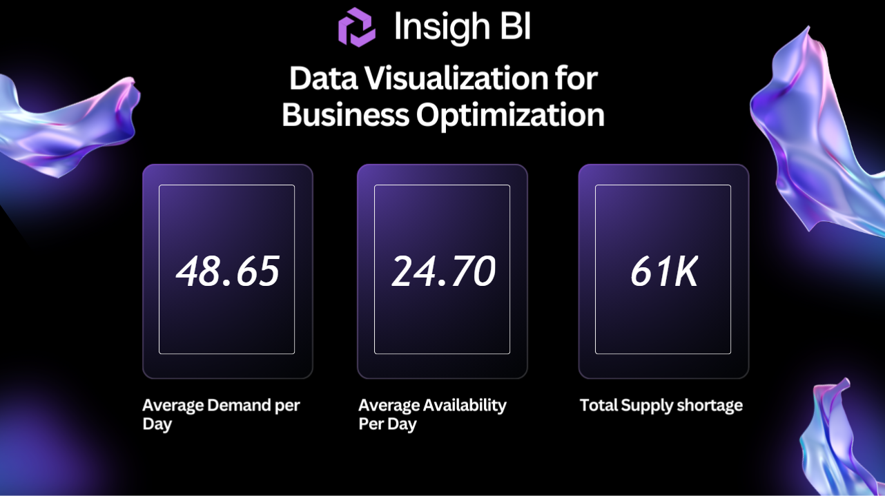
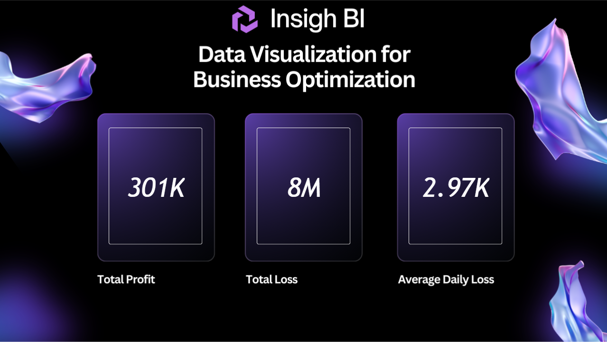

# Inventory Environment Migration & Analytics Dashboard

<div align="center">


*An enterprise-grade workflow for migrating inventory analytics from TEST → PRODUCTION with uninterrupted Power BI reporting.*

</div>

---

## Project Overview

This project simulates an enterprise workflow for transitioning inventory analytics from a **TEST** environment into a **PRODUCTION** environment while maintaining reporting continuity in Power BI.

| Phase | Description |
|---|---|
| Environment Setup | Built TEST and PROD database environments in MySQL |
| Data Ingestion | Imported inventory datasets from CSV sources |
| Data Cleaning | Cleaned, transformed, and deduplicated records |
| SQL | Performed JOIN operations for reporting preparation |
| Dashboard Build | Created multi-page Power BI dashboards |
| Migration | Transitioned datasource from MySQL Server → MySQL Database via Connector |

---

## Architecture

```
CSV Data Sources
       │
       ▼
TEST Database (MySQL)
       │
       ▼
SQL Cleaning & JOIN Transformations
       │
       ▼
Prepared Reporting Table
       │
       ▼
Power BI Dashboard (TEST)
       │
       ▼
PROD Database Migration
       │
       ▼
MySQL Workbench + Connector
       │
       ▼
Power BI Source Transition
       │
       ▼
Production Dashboard Deployment
```

---

## Environment Setup

### TEST Environment

**Tables Created:**
- `Products`
- `Test_Environment_Inventory_Dataset`

**Steps Completed:**

1. Imported CSV files into MySQL
2. Performed `LEFT JOIN` operations across tables
3. Created the reporting table
4. Connected Power BI to the TEST database
5. Adjusted datatypes using Power Query
6. Built and validated the dashboard

---

### Production Environment

**Tables Created:**
- `Products1`
- `PROD_Environment_Inventory_Dataset`

**Tasks Completed:**

- Imported production datasets
- Removed duplicate and extra Product IDs
- Cleaned and standardized inventory records
- Structured the production dataset for reporting
- Applied `LEFT JOIN` transformation
- Built and validated the production reporting table

---

## Dashboard Features

### Page 1 - Inventory Availability Metrics

> Tracks supply-demand balance across the inventory timeline.

**KPIs:**

<div align="center">

| Metric | Description |
|---|---|
| Average Demand Per Day | Mean daily product demand |
| Average Availability Per Day | Mean daily stock on hand |
| Total Supply Shortage | Cumulative shortfall across the period |
</div>
**Filters:** Date Range · Product



---

### Page 2 - Financial Impact Metrics

> Quantifies the revenue and loss impact of supply chain performance.

**KPIs:**

<div align="center">

| Metric | Description |
|---|---|
| Total Loss | Revenue lost due to stockouts |
| Total Profit | Revenue generated from fulfilled demand |
| Average Daily Loss | Mean daily financial impact of shortages |

</div>
**Filters:** Date Range · Product



---

## ETL & Transformation Workflow

### SQL Tasks

<div align="center">

| Task | Status |
|---|---|
| Data imports | Complete |
| LEFT JOIN preparation | Complete |
| Reporting table creation | Complete |
| Product cleanup | Complete |
| Production restructuring | Complete |
</div>
### Power Query Tasks
<div align="center">
| Task | Status |
|---|---|
| Datatype conversion | Complete |
| Data validation | Complete |
| Report preparation | Complete |
</div>
---

## Data Source Migration

| | Before | After |
|---|---|---|
| **Datasource** | MySQL Server | MySQL Database |
| **Connector** | Direct connection | MySQL Connector |
| **Tool** | - | MySQL Workbench |

**Migration Steps:**

1. Created the PROD server in MySQL Workbench
2. Imported all production datasets
3. Configured the MySQL Connector
4. Redirected the Power BI datasource to PROD
5. Re-published the report using the production source

---

## Technologies

| Tool | Purpose |
|---|---|
| **MySQL** | Relational database engine |
| **MySQL Workbench** | Database management & query interface |
| **SQL** | Data cleaning, joins, and reporting prep |
| **Power BI** | Dashboard creation and data visualization |
| **Power Query** | In-report data transformation and type management |
| **MySQL Connector** | Bridge between MySQL and Power BI |

---

<div align="center">
<sub>Built to demonstrate enterprise ETL and BI migration workflows.</sub>
</div>
